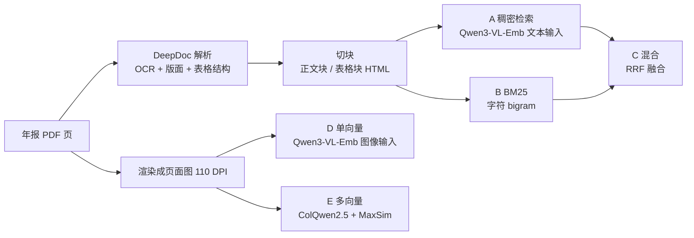

# 原理：中文文档检索的解析式与视觉式

这份文档讲清楚三件事：两条检索路线各自怎么工作，这个实验怎么保证比较是公平的，以及目前的结果说明了什么。
实验的执行细节（环境、命令、踩过的坑）在 [HANDOFF.md](HANDOFF.md)，研究计划与写死的终止条件在 [DESIGN.md](DESIGN.md)。

> 结果部分基于 2026-09-29 的首批真实规模评测（job 176136）。查询集的人工抽检还没做完，残余噪声率尚未量化，数字可能随之修正。

---

## 一、要回答的问题

一个中文 RAG 系统拿到一堆 PDF（这里是上市公司年报），用户问「珍宝岛银行承兑票据期末终止确认金额是多少」，系统要先从几千页里找出答案所在的那一页，再交给大模型作答。本项目只研究**第一步：找页**。

找页有两条路线：

- **解析式**：先把 PDF 还原成文字（OCR、版面分析、表格结构识别），切块，再用文本检索找块，最后把块映射回页。RAGFlow、MinerU 走这条路，也是目前中文 RAG 的主流。
- **视觉式**：不做任何解析，把每一页直接当图片，用视觉语言模型编码成向量，查询也编码成向量，比相似度。ColPali / ColQwen 走这条路。

年报里大量是多级表头、合并单元格、跨页续表的财务表格。解析式在这些地方容易把结构拆坏；视觉式绕开了解析，但代价是模型得自己从像素里读懂表格。**哪条路在中文上更好、好在哪类页面上**，此前没有公开数据：ViDoRe、VisR-Bench 等视觉文档检索基准都不含中文（核查过程见 [plan.md](plan.md) 第二节）。

---

## 二、两条路线怎么工作

### 2.1 解析式

**解析**用 RAGFlow 的 DeepDoc 模块（脱离 RAGFlow 服务栈单独运行，改造方式见 HANDOFF 第五节）。每页输出若干块，块只有两种类型：`text`（正文）和 `table`（表格，带 HTML 结构，合并单元格表示为 `rowspan` / `colspan`）。2400 页共得到 12969 块。

**A　稠密检索。** 用 Qwen3-VL-Embedding-2B 把每个块编码成一个 2048 维向量，查询也编码成一个向量，按余弦相似度打分：

$$s(q, c) = \frac{\mathbf{q} \cdot \mathbf{c}}{\|\mathbf{q}\|\,\|\mathbf{c}\|}$$

一页有多个块，**页的得分取其中最高的块**：$s(q, p) = \max_{c \in p} s(q, c)$。

**B　BM25。** 经典词法检索。中文没有空格，这里不用分词器，而是把文本切成**字符 bigram 加单字**作为词项（避免把「分词器选得好不好」混进结论）：

$$\text{BM25}(q, c) = \sum_{t \in q} \text{IDF}(t) \cdot \frac{f(t, c)\,(k_1 + 1)}{f(t, c) + k_1 \left(1 - b + b \cdot \frac{|c|}{\text{avgdl}}\right)}$$

其中 $f(t,c)$ 是词项在块中的频次，$k_1 = 1.5$、$b = 0.75$ 取标准值。页得分同样取块得分的最大值。

**C　混合。** RAGFlow 实际用的是稠密加词法的混合检索，只比单一方法对解析式不公平。两路分数量纲不同（余弦在 −1 到 1，BM25 无上界），直接加权需要调归一化参数，那会把「融合调得好不好」混进结论。所以用**倒数排名融合（RRF）**，只看排名：

$$\text{RRF}(p) = \sum_{r \in \{A, B\}} \frac{1}{k + \text{rank}_r(p)}, \quad k = 60$$

**A′　按行切块（消融）。** 把每张表按 `<tr>` 拆成行，每行前面拼上表格标题，单独作为检索单元（31666 块）。用来检验「整张表压成一个大块、信息被稀释」这个猜想。

### 2.2 视觉式

**D　单向量。** 同一个 Qwen3-VL-Embedding-2B，这次输入页面图，整页编码成一个 2048 维向量。打分方式与 A 完全相同。

**E　多向量（后期交互）。** ColQwen2.5 把一页编码成**一组** 128 维向量，每个向量对应图像的一小块区域（本实验中每页 747 个）；查询也编码成一组向量，每个对应一个 token。相似度用 MaxSim：对查询的每个 token，找页面上最相似的那块区域，再求和：

$$s(q, p) = \sum_{i=1}^{|q|} \max_{j=1}^{|p|} \mathbf{q}_i \cdot \mathbf{p}_j$$

直觉是：查询里「银行承兑票据」这几个 token 可以各自去页面上找自己对应的格子，而不必先把整页压成一个向量。代价是存储：每页 747 个向量，是单向量的数百倍。

### 2.3 为什么设这五个系统

| 对比 | 控制了什么 | 回答什么 |
|---|---|---|
| **A vs D** | 同一套权重、同一页内容，唯一变量是「喂文字还是喂图」 | 表示形式本身的影响 |
| **C vs E** | 两条路线各自的最强配置（预先登记） | 实际选型该选哪条 |
| A′ vs A | 只改切块粒度 | 解析式的劣势有多少来自切块 |

A vs D 是整个实验的核心。早期 MVP 里解析式用 BGE-m3、视觉式用 ColQwen2.5，两边模型不同，差距里约 40% 其实来自模型差异而不是表示形式。换成同一个能同时吃文字和图像的嵌入模型，才把这个混淆去掉。

---

## 三、怎么保证比较是公平的

检索评测最容易被质疑的地方不是模型，而是**查询集和真值**。下面每一条都对应一个实测到的偏差。

### 3.1 查询从哪来：双源出题

440 条查询由 Qwen2.5-VL-7B 自动生成。问题在于：

- 模型**看着页面图**出题，问题会带上版面线索（比如表格的列名组合），天然偏向视觉式；
- 模型**看着解析文本**出题，问题会贴合解析后的措辞，天然偏向解析式。

所以两种方式各出一半（图像源 221 条、文本源 219 条），用同一个模型、同一套提示词，**分开报指标**。判据：两条路线的优劣在两组上方向一致，结论才算稳；方向相反，说明差距主要来自出题偏差，必须重做查询集。

### 3.2 答案对不对：独立的接地参照

每条查询的答案必须能在出题页的原文里找到（最佳子串相似度 ≥ 0.7），否则丢弃。关键是**拿什么当原文**：

- 如果用 DeepDoc 的解析文本当参照，那些「图上清清楚楚、但被 DeepDoc 解析坏了」的页，会因为答案对不上而被丢掉——恰好剔掉了解析式最难的样本，等于给解析式放水。
- 所以用 **pdfplumber 直接读 PDF 内嵌的文字层**当参照，它和 DeepDoc、和视觉模型都无关。

### 3.3 真值是不是唯一的：多页真值

查询里强制带公司名，但同一个数字仍可能出现在多页（比如利润表和附注里各出现一次）。如果只把出题那页记为正确，系统召回了另一页也会被判错。所以把**答案串出现的所有页都记为真值**；出现超过 8 页的判为没有区分度，丢弃。440 条里有 144 条是多页真值。

### 3.4 查询质量：六道过滤

三轮小规模试跑（每轮每源 5–25 页）逐条人工查看，抓到的每一类坏样本都对应一道规则（详见 `scripts/filter_queries.py` 的文档串）：

| 坏样本 | 实例 | 规则 |
|---|---|---|
| 答案是准则条文而不是值 | 问「……金额是多少」，答案是 89 字会计准则原文 | 答案 > 30 字丢弃 |
| 抄页面小标题当问题 | 「中粮科技期末公司已质押的应收款项融资」 | 剥掉公司名前缀再测与答案的相似度 |
| 答案写在问题里 | 「优利德在全球有近400家经销商」→「近400家」 | 答案原样出现在问题中即丢弃 |
| 答案是指引 | 「详见本节"五、重要会计政策……"」 | 以「详见/参见」开头即丢弃 |
| 表格残片 | 「255,3」（窄列表格折行，PDF 文字层本身就是断的） | 千分位格式不合法即丢弃 |
| 模型编造年份 | 「海联讯2024年资产负债表……」，该页没有任何年份 | 提示词不给年份，只许用页面上写明的 |

过滤后两个源的留用率是 69% 和 68%，各类丢弃数也几乎一致，说明过滤本身没有对某一个源不公平。

有两类问题规则拦不住，留给人工抽检：答案确实在页上但对错了表格行；同一页两个问题给出同一个答案。

### 3.5 分层：两套独立口径

「好在哪类页面上」需要给每页标类型：纯文字、普通表格、复杂表格（含合并单元格）。DESIGN 原定用 DeepDoc 的版面输出来标，但 DeepDoc 本身是解析式路线的一部分：一张表如果被 DeepDoc 漏认成正文，这页会被标成「纯文字」，解析式最难的页就被移出了复杂表格层。

所以再用 **pdfplumber 读 PDF 矢量层**独立标一遍，两套口径都报。两者判断合并单元格的方式不同（DeepDoc 从图像识别表格结构，能看出没画线的跨行格；pdfplumber 靠表格线划分单元格），逐页一致率只有 71%。交叉核对要回答的是：**换一个完全独立的标注方式，结论还在不在**。

### 3.6 统计：配对自助法

两个系统在同一批查询上各得一组 nDCG@5，逐条相减得到 $d_i$。对这 440 个差值有放回重采样 10000 次，每次算均值，取 2.5% 和 97.5% 分位数作为 95% 置信区间。置信区间不跨 0 即为显著。

用配对而不是两组独立比较，是因为查询难度差异很大（有的查询所有系统都答不上），配对能把这部分方差消掉。

### 3.7 指标

- **nDCG@5**（主指标）：前 5 名里命中真值的位置越靠前得分越高，按理想排序归一化到 0–1。
- **R@k**：前 k 名命中的真值页数 ÷ 真值总页数。注意多页真值时 R@1 有上限：一条有 4 个真值页的查询，R@1 最高只有 0.25。这是表中 R@1 普遍偏低的原因之一。
- **MRR**：第一个命中真值的名次的倒数。

---

## 四、结果

440 条查询，候选池 2400 页（40 家公司各 60 页，混在一起检索）。

### 4.1 总体

| 系统 | nDCG@5 | R@1 | R@5 | MRR |
|---|---|---|---|---|
| A 解析式·稠密 | 0.386 | 0.239 | 0.469 | 0.435 |
| A′ 解析式·按行切块 | 0.343 | 0.218 | 0.416 | 0.394 |
| B 解析式·BM25 | 0.412 | 0.276 | 0.481 | 0.474 |
| C 解析式·混合 | 0.431 | 0.273 | 0.516 | 0.482 |
| **D 视觉式·单向量** | **0.490** | 0.307 | **0.587** | **0.525** |
| E 视觉式·多向量 | 0.457 | **0.320** | 0.540 | 0.507 |

| 对比 | Δ nDCG@5 | 95% 置信区间 | p |
|---|---|---|---|
| **D − A** 受控：只换表示形式 | **+0.104** | [+0.068, +0.141] | < 0.001 |
| E − C 预先登记的最强对最强 | +0.026 | [−0.014, +0.065] | 0.20（不显著） |
| D − C 事后补做 | +0.058 | [+0.021, +0.096] | 0.002 |
| A′ − A 按行切块 | −0.042 | [−0.068, −0.017] | 0.001 |

**表示形式本身有显著影响。** 同一个模型，喂页面图比喂解析文本高 0.10。图像源 +0.108、文本源 +0.100，连本该偏向解析式的文本源也是视觉式赢，按 3.1 的判据结论稳定。

**预先登记的「最强对最强」不显著，这一点要如实报。** DESIGN 假设多向量 E 是视觉式上限，结果单向量 D 反而更好（E − D = −0.033，p = 0.051）。D − C 显著，但它是看到结果后才补的比较，只能作为事后分析。一个可能的原因是 ColQwen2.5 的训练数据以英文为主，而 Qwen3-VL-Embedding 是多语言模型；这一点没有做实验验证。

### 4.2 按页面类型

| 页面类型 | DeepDoc 口径 D − C | pdfplumber 口径 D − C |
|---|---|---|
| 纯文字 | −0.021（n=58，不显著） | −0.039（n=60，不显著） |
| 普通表格 | +0.055（n=268，p=0.033） | −0.015（n=141，不显著） |
| **复杂表格** | **+0.106**（n=114，p=0.003） | **+0.126**（n=239，p < 0.001） |
| 跨页续表 | +0.068（p=0.011） | +0.056（p=0.093，不显著） |

**视觉式的优势集中在复杂表格上，纯文字页两者持平。** 这一点在两套独立口径下都成立。跨页续表一层换口径后不再显著，不作为主结论。

### 4.3 机制：各系统错在哪

把失败拆成「找错了公司」和「公司对了但页码错」：

| 系统 | top1 公司对 | 其中页码错 |
|---|---|---|
| D 视觉单向量 | 73% | 43% |
| A 文本稠密 | 70% | 46% |
| B BM25 | 56% | 28% |
| E 视觉多向量 | 55% | 23% |

单向量方法（A、D）擅长找对公司，但在同一家公司的 60 页里分不清是哪一页——年报相邻页常常是同一张表的延续，整页压成一个向量后彼此过于相似。E 和 BM25 找公司差一些，但同一家公司内部定位更准，因为它们能对具体的词或区域做细粒度匹配。

这说明两类方法的长处互补。「先用单向量圈定公司、再用细粒度方法在公司内精排」很可能超过现有所有系统，是下一步的候选方向（尚未验证）。

### 4.4 推翻了的猜想

MVP 阶段观察到一张三级表头的表被压成一个 2139 字的大块，由此推测「大块稀释了信息，按行切块能挽回差距」。实测按行切块反而**更差**（−0.042，显著）。拆成行之后，每一行丢掉了它属于哪张表、哪家公司、哪个报告期的上下文，检索单元虽然更聚焦，但也更难和查询里的公司名对上。

---

## 五、局限

- **查询由模型生成**，不是真实用户问题。双源设计能测量出题偏差，但不能消除「模型式提问」和真实提问之间的差距。
- **人工抽检尚未完成**，查询集的残余噪声率未知。已知有规则拦不住的错误类型（对错表格行、同页两问同答）。
- **只有年报一种文档**。结论能否推广到合同、论文、说明书，没有数据支持。
- **语料是 2024 年发布的年报，报告期以 2023 年为主**（35 份；2022 年 3 份、2021 与 2020 年各 1 份，多为更正或修订版）。抓取时只按发布日期筛选，早期文档误写为「2024 年年报」，已更正。出题提示词不给年份，查询里的年份只来自页面本身。
- **只测了检索，没测生成**。找对页之后大模型能否答对，是另一个问题。
- **没有测最新的视觉检索模型**。Ops-Colqwen3-4B 在 ViDoRe 上是 SOTA，多向量路线的上限可能被 ColQwen2.5 低估了。
- 运行环境从原机器的 cu126 换成了 cu128（集群有 Blackwell 显卡），本机结果不应与原机器的 MVP 数字直接对比。
